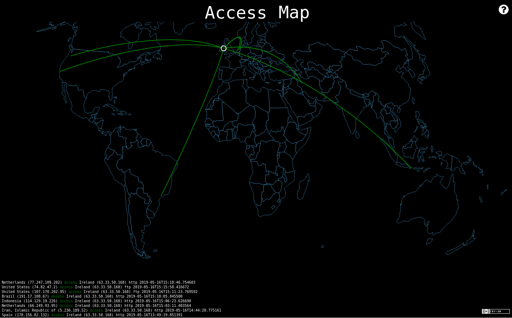

### Access Map Visualization
Access Map Visualization is a project based on [IPew Attack Map](https://github.com/hrbrmstr/pewpew)

* This visualization is synchronized with [conpot](https://github.com/mushorg/conpot)
* The honeypot logs are downloaded on conpot.json
* A key to identify the ip address location must be created from [ipinfodb](https://ipinfodb.com/) in *const apikey*, e.g. const apiKey = "2ea8993acc6dcfee7b2a4a9ac1d14888f002f19a028b7751bf02f84dcdd45951";
